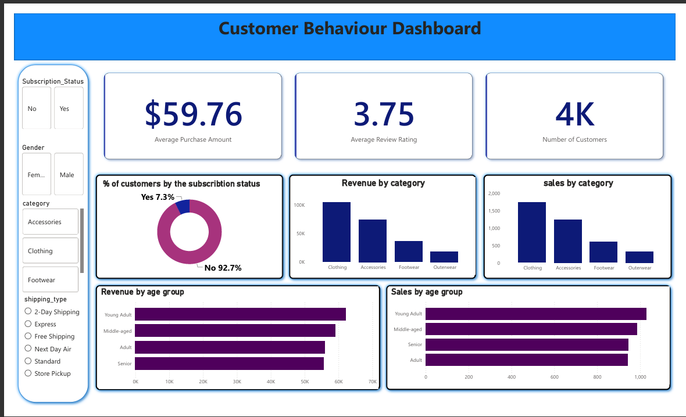

# customer-shopping-analysis
Using retail data to find trends in customer spending, subscriptions, and ratings. Built using Python, PostgreSQL, and Power BI.

# Customer Shopping Behavior Analysis 

This project analyzes a dataset of 3,900 customer purchases across different product categories. It covers data cleaning in Python, running database queries in SQL, and building an interactive dashboard in Power BI to understand how people shop.

##  Project Overview
The main goal of this project is to figure out patterns in customer spending, age groups, product preferences, and subscription status to help a business make smarter decisions.

##  Tools Used
* **Python (Pandas):** For data cleaning and preparation.
* **PostgreSQL:** For querying the clean data and answering business questions.
* **Power BI:** For building an interactive visual dashboard.

##  Dataset Summary
* **Total Rows:** 3,900 purchases
* **Columns:** 18 features (including Age, Gender, Purchase Amount, Subscriptions, and Ratings)
* **Data Cleaning:** Handled 37 missing review ratings by filling them with the median rating for that product category. Also dropped redundant promo code columns and grouped ages into segments.

---

## 🚀 Key Insights from SQL

* **Gender Spending:** Male customers generated more total revenue (\$157,890) compared to Female customers (\$75,191).
* **Top Category:** Clothing is the most purchased product category.
* **Subscriptions:** Out of the repeat buyers, 2,518 are not subscribed, while 958 are subscribed. This is a huge opportunity for a loyalty program!
* **Age Groups:** Young Adults bring in the highest total revenue (\$62,143), followed closely by Middle-aged customers.

---

 📈 Dashboard Preview
*(Take a screenshot of your Power BI dashboard, name the file dashboard.png, upload it to this GitHub repository, and it will show up below!)*

### Core Metrics Tracked:
* **Total Customers:** 3.9K
* **Average Purchase:** \$59.76
* **Average Rating:** 3.75

---

##  Quick Recommendations
1. **Target Unsubscribed Regulars:** Create a small discount campaign aimed at the 2,518 repeat buyers who aren't subscribers yet to convert them.
2. **Watch the Discounts:** Items like Hats and Sneakers have very high discount rates (~50%). Balance these to keep profit margins healthy.
3. **Focus on Young Adults:** Put more marketing effort into the Young Adult age group since they are your biggest revenue drivers.
